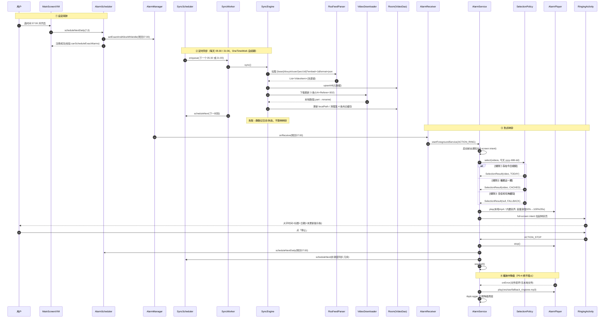
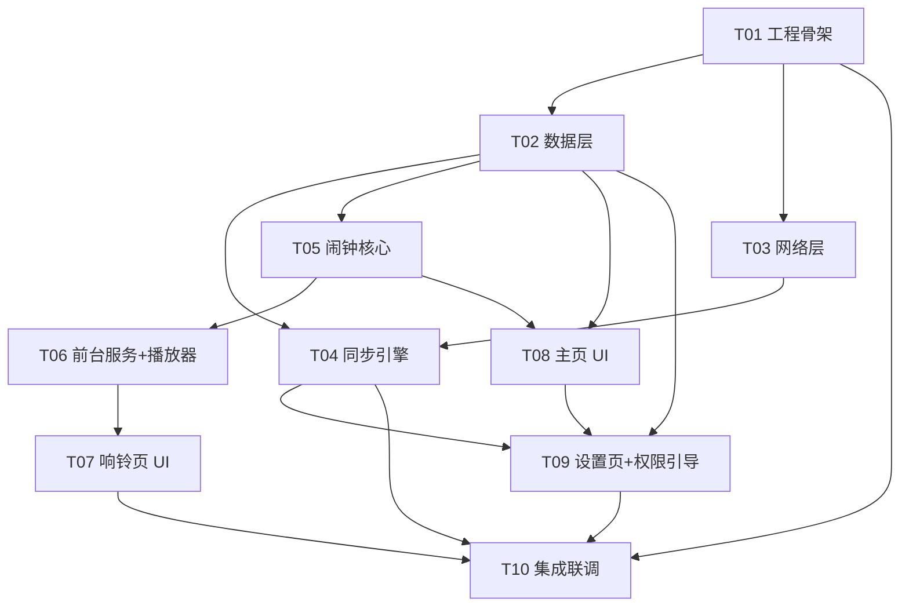

# 架构设计：每日早安音频闹钟（GoodMorning Alarm）

> 架构师：高见远（Bob）｜基于 PRD v1（docs/PRD.md）+ 用户已拍板决策
> 目标：交付可导入 Android Studio 直接 Run 的完整 Kotlin + Compose 工程

---

## 1. 实现方案总述与框架选型结论

### 1.1 总体架构

单模块 Android App（`app`），Kotlin + Jetpack Compose（Material3），分层：

```
UI 层（Compose + ViewModel）
  ├─ MainScreen（设闹钟/倒计时/同步状态）
  ├─ RingingActivity（锁屏全屏响铃页）
  ├─ SettingsScreen（RSSHub 地址/贪睡/音量渐强/立即同步）
  └─ PermissionGuideScreen（HyperOS 权限分步引导）
业务层
  ├─ AlarmScheduler / AlarmReceiver / BootReceiver（闹钟可靠性链路，仅依赖 AlarmManager）
  ├─ SyncEngine / SyncWorker / SyncScheduler（WorkManager 定时同步 05:30 / 21:00）
  ├─ SelectionPolicy（选片规则，PRD §5）
  └─ AlarmService + AlarmPlayer（前台服务 + ExoPlayer 纯音频 + 音量渐强）
数据层
  ├─ Room（视频元数据 + 播放历史/同步日志）
  ├─ DataStore Preferences（设置项：闹钟时间/RSSHub 地址/贪睡时长/音量渐强开关）
  └─ 网络（OkHttp：RSSHub 拉取 + 抖音视频下载）
```

**可靠性总原则（HyperOS 适配核心）**：闹钟触达链路 = `AlarmManager.setExactAndAllowWhileIdle → AlarmReceiver → AlarmService 前台服务 → full-screen intent 拉起 RingingActivity`，全程不经过 WorkManager；WorkManager 只负责"缓存新鲜度"，它挂了不影响响铃（有三级兜底）。每日闹钟响完/贪睡注册时顺带"顺手补调度"同步任务，形成多重冗余。

### 1.2 选型结论一：音频播放 —— **ExoPlayer 纯音频模式播 mp4（胜出）**

| 维度 | ExoPlayer 纯音频播 mp4 | ffmpeg-kit 提取音频 |
|---|---|---|
| 依赖体积 | 0 额外原生库（Media3 已是既定栈） | ~20-70MB 原生 so，APK 显著膨胀 |
| 维护状态 | Google 官方持续维护 | **ffmpeg-kit 已被作者归档停止维护**（Liu大的 Arthenica/ffmpeg-kit 已 retired），长期风险高 |
| 存储 | 2-3 条 mp4 × 10-30MB ≈ 100MB 内，完全可接受 | 每条省 60-80%，但绝对值无意义 |
| 实现复杂度 | `ExoPlayer + AudioAttributes(USAGE_ALARM)`，`videoTrackDisabled`，两行代码级 | 需额外下载→转码→删除源文件流水线，失败点+1 |
| 解码 | ExoPlayer 对 mp4/H.264+AAC 软硬解均成熟 | 同样依赖系统解码或自带解码 |

**结论：ExoPlayer（Media3）纯音频模式直接播本地 mp4。** 不引入 ffmpeg-kit。播放时禁用视频轨、走 `USAGE_ALARM` 音频属性（系统闹钟音量通道）。

### 1.3 选型结论二：下载器 —— **OkHttp（胜出）**

选 OkHttp 而非 Ktor：
1. 抖音播放地址（`douyin.com/aweme/v1/play/?video_id=...`）会 **302 重定向到 CDN**（`v26-web.douyinvod.com/.../video/tos/....mp4`），OkHttp 默认 `followRedirects(true)`，也可以用 `followRedirects(false)` 手动读 `Location`（对应调研确认的 python `allow_redirects=False` 方案），控制力最强。
2. 自定义 `User-Agent`（移动端 Safari UA）+ `Referer: https://www.douyin.com/` 头是一行 Interceptor 的事。
3. 与 WorkManager 协程天然契合（`execute()` 同步阻塞可在 `Dispatchers.IO` 直接调用），无需引入 Ktor 引擎依赖。
4. 体量小、API 稳定、团队认知成本最低。

### 1.4 RSSHub 数据链路设计（调研结论）

**已核实 RSSHub 源码**（`lib/routes/douyin/user.ts`，master 分支）：

1. **路由路径是 `/douyin/user/:uid`**（`uid` 即 sec_uid，必须以 `MS4wLjABAAAA` 开头），**不是** `/douyin/user/video/:sec_uid`（旧文档路径，已废弃）。App 请求 URL 固定拼接为：
   ```
   {rsshubBaseUrl}/douyin/user/{secUid}?embed=1&format=json
   ```
   - `embed=1`：让 description 中内嵌 `<video src="...">` 标签，否则只有封面图；
   - `format=json`：RSSHub 内建支持，返回 JSON Feed（`{title, item: [{title, description, link, pubDate, ...}]}`），比解析 RSS XML 更稳。
2. **条目字段映射**（源码 `items = aweme_list.map(...)`）：
   - `item.title` = 视频文案首行（`post.desc.split('\n',1)[0]`）
   - `item.link` = `https://www.douyin.com/video/{aweme_id}`（aweme_id 即唯一键）
   - `item.pubDate` = `create_time * 1000`（epoch 毫秒，转本地 yyyy-MM-dd 判"当天"）
   - `item.description` = HTML，含 `<video src="{play_addr 直链}">`（embed=1 时）；视频直链来自 `post.video.bit_rate[].play_addr.url_list.at(-1)`，形如 `https://www.douyin.com/aweme/v1/play/?video_id=xxx&line=0`（302 → CDN mp4）
3. **直链下载要求**（调研确认）：请求头 `User-Agent: Mozilla/5.0 (iPhone; ...)`（移动端 UA，桌面 UA 可能被 403）+ `Referer: https://www.douyin.com/`；跟随 302；**链接有时效性**（数小时级别），所以必须"同步后立即下载"，不能到响铃时才下。
4. **重要风险**：该路由在 RSSHub 标记 `requirePuppeteer: true, antiCrawler: true`——官方公共实例 `rsshub.app` **可能无法出数据或被 WAF 拦**（源码中明确抛 "The request may be filtered by WAF"）。应对策略：
   - 默认 Base URL 填 `https://rsshub.app`（PRD 要求），设置页支持一键换自建实例；
   - 同步失败**静默重试 + 不影响响铃**（三级兜底保证）；
   - 同步结果与错误信息在设置页可见，文案引导用户换自建 RSSHub 实例；
   - 解析器容错：优先从 `<video src>` 提取，失败则用正则兜底匹配 description 中任意 `douyinvod.com` / `aweme/v1/play` / `.mp4` URL。

**数据流**：`SyncWorker →(OkHttp, format=json)→ RssFeedParser 解析出 List<VideoItem> → Room upsert（去重 by aweme_id）→ 取最新 3 条 → 逐条 VideoDownloader 下载（UA+Referer+302，写 .part 再 rename）→ 更新 localPath → 清理超出保留数的旧文件与记录`。

### 1.5 关键机制明细

| 机制 | 设计 |
|---|---|
| 精确闹钟 | `AlarmManager.setExactAndAllowWhileIdle(RTC_WAKEUP, ...)`，每次响铃结束/贪睡时注册下一次；Android 12+ 检查 `canScheduleExactAlarms()`，未授权则引导跳系统设置 |
| 重启恢复 | `BootReceiver` 监听 `BOOT_COMPLETED`（+`QUICKBOOT_POWERON`/`TIME_SET`），重注册闹钟 + 重调度同步 |
| 每日重复 | 不用 `setRepeating`（Doze 下不精确），用"响一次 → 结束时算明天同一时刻 → 再 setExact"的自续期模式 |
| 同步时机 | 每天 05:30 / 21:00。用 **OneTimeWorkRequest 自续期链**（每次跑完调度下一个 05:30/21:00 中较近者）而非 PeriodicWork——对 HyperOS 更友好；另在 BootReceiver、每次闹钟结束时补调度 |
| 音量渐强（P1） | ExoPlayer `player.volume` 从 0.30 起，协程每 500ms 步进，20s 内线性升至 1.0；设置页可关（关闭即 100% 直接播） |
| 贪睡 | 默认 10 分钟，设置页 5/10/15 可选；实现 = AlarmScheduler 注册 N 分钟后一次性精确闹钟（同一 action），响铃页重跑选片逻辑 |
| 前台通知 | 响铃期间 `FOREGROUND_SERVICE_MEDIA_PLAYBACK` 类型前台服务，通知含"停止"Action + full-screen intent 指向 RingingActivity |
| 锁屏直达 | RingingActivity 设 `showWhenLocked` + `turnScreenOn`，`setShowWhenLocked(true)`，window brightness 保持 |
| 兜底铃声 | `res/raw/fallback_ringtone.mp3` 内置资产，任何异常（无缓存/文件损坏/播放器 error）切换播放，**绝不哑火**（P0-4） |

---

## 2. 完整文件列表

包名 `com.goodmorning.alarm`。根目录 `goodmorning-alarm/`。

### 2.1 工程配置（10 个文件）

| 文件 | 职责 |
|---|---|
| `settings.gradle.kts` | 声明仓库与 `:app` 模块 |
| `build.gradle.kts` | 根构建脚本，插件声明（AGP/Kotlin/Compose/Serialization） |
| `gradle.properties` | AndroidX 开关、JVM 参数 |
| `gradle/libs.versions.toml` | 全部依赖版本目录（单一事实来源） |
| `gradle/wrapper/gradle-wrapper.properties` | Gradle 8.9 分发版本 |
| `gradle/wrapper/gradle-wrapper.jar` | Wrapper 二进制（gradle wrapper 生成） |
| `gradlew` / `gradlew.bat` | Wrapper 脚本 |
| `app/build.gradle.kts` | App 模块：compileSdk 35 / minSdk 29 / targetSdk 35、Compose、Room/DataStore kapt/ksp、依赖引用 |
| `app/proguard-rules.pro` | Release 混淆规则（kotlinx-serialization、Media3 keep 规则） |

### 2.2 清单与资源（9 个文件）

| 文件 | 职责 |
|---|---|
| `app/src/main/AndroidManifest.xml` | 权限（SCHEDULE_EXACT_ALARM、USE_EXACT_ALARM、RECEIVE_BOOT_COMPLETED、POST_NOTIFICATIONS、INTERNET、WAKE_LOCK、FOREGROUND_SERVICE、FOREGROUND_SERVICE_MEDIA_PLAYBACK）+ 组件注册 |
| `app/src/main/res/values/strings.xml` | 全部用户可见文案（含「今日尚未更新，为你播放最近一期」） |
| `app/src/main/res/values/themes.xml` | Material3 主题（Compose 之外的系统侧主题） |
| `app/src/main/res/raw/fallback_ringtone.mp3` | 第三级兜底内置铃声资产 |
| `app/src/main/res/drawable/ic_notification.xml` | 状态栏通知小图标 |
| `app/src/main/res/drawable/ic_launcher_foreground.xml` | 启动图标前景 |
| `app/src/main/res/drawable/ic_launcher_background.xml` | 启动图标背景 |
| `app/src/main/res/mipmap-anydpi-v26/ic_launcher.xml` | 自适应启动图标 |
| `app/src/main/res/xml/backup_rules.xml` | 备份规则（排除缓存目录） |

### 2.3 Kotlin 源码（30 个文件）

**应用入口与全局（2）**

| 文件 | 职责 |
|---|---|
| `app/src/main/java/com/goodmorning/alarm/GoodMorningApp.kt` | Application：创建通知渠道、启动时闹钟自检重注册、启动时补调度同步 Worker |
| `app/src/main/java/com/goodmorning/alarm/MainActivity.kt` | 唯一入口 Activity，挂 Compose 导航（主页/设置/权限引导） |

**data 数据层（10）**

| 文件 | 职责 |
|---|---|
| `data/db/AppDatabase.kt` | Room 数据库单例（version=1，exportSchema=false） |
| `data/db/VideoEntity.kt` | 视频元数据实体（aweme_id 主键等，见 §3） |
| `data/db/VideoDao.kt` | 视频表 DAO（upsert/最新一条/按日期/清理） |
| `data/db/PlaybackLogEntity.kt` | 播放历史实体（date、videoId、source、playedAt） |
| `data/db/PlaybackLogDao.kt` | 播放历史 DAO（插入、查最近 30 条） |
| `data/db/Converters.kt` | Room 类型转换器（如有需要） |
| `data/prefs/SettingsRepository.kt` | DataStore 封装：闹钟开关/时间、RSSHub BaseURL、贪睡时长、音量渐强开关、最近同步状态；暴露 `Flow<Settings>` 与 suspend setter |
| `data/prefs/Settings.kt` | 不可变设置数据类 |
| `data/repo/VideoRepository.kt` | 对上层门面：查缓存视频、选片输入、播放历史写入 |
| `data/repo/CacheCleaner.kt` | 缓存清理：只保留最近 3 条本地文件，删多余文件+记录；统计占用大小 |

**network 网络层（4）**

| 文件 | 职责 |
|---|---|
| `network/Http.kt` | OkHttp 单例 + 抖音 UA/Referer 常量 + 超时配置 |
| `network/RssFeedParser.kt` | 解析 RSSHub JSON Feed（`format=json`）：提取 title/pubDate/aweme_id/视频直链（`<video src>` 正则 + mp4 URL 兜底正则） |
| `network/VideoDownloader.kt` | 下载单条视频到 `filesDir/videos/{aweme_id}.mp4.part` 后原子 rename；校验 Content-Length 与魔数；返回本地路径 |
| `network/FeedModels.kt` | 解析结果数据类 `VideoItem(id,title,publishTimeMillis,pageUrl,videoUrl)` |

**sync 同步（3）**

| 文件 | 职责 |
|---|---|
| `sync/SyncEngine.kt` | 核心同步编排：拉取→解析→upsert Room→下载最新 3 条→清缓存→写同步状态与日志（含错误分类 NETWORK/PARSE/EMPTY/DOWNLOAD） |
| `sync/SyncWorker.kt` | WorkManager CoroutineWorker，调 SyncEngine，输出成功条数/失败原因 |
| `sync/SyncScheduler.kt` | 计算下一个 05:30 / 21:00 时刻，enqueue OneTimeWorkRequest（自续期链） |

**alarm 闹钟核心（4）**

| 文件 | 职责 |
|---|---|
| `alarm/AlarmScheduler.kt` | 精确闹钟注册/取消（setExactAndAllowWhileIdle + PendingIntent）；`scheduleNextDaily(hour,min)`、`scheduleSnooze(minutes)`、`canScheduleExactAlarms()` 检查 |
| `alarm/AlarmReceiver.kt` | 到点接收：`context.startForegroundService(AlarmService)`（Android 12+ 后台启动 FGS 例外：精确闹钟触发允许） |
| `alarm/BootReceiver.kt` | BOOT_COMPLETED/TIME_SET：重注册闹钟 + 补调度同步 |
| `alarm/SelectionPolicy.kt` | 选片规则（PRD §5）：当天→最新缓存→兜底铃声，返回 `SelectionResult(video, source, isFallback)` |

**playback 播放（2）**

| 文件 | 职责 |
|---|---|
| `playback/AlarmService.kt` | 前台服务：选片→起播→发 full-screen intent 通知；处理 ACTION_STOP/ACTION_SNOOZE；停止时注销通知并注册明天闹钟 |
| `playback/AlarmPlayer.kt` | ExoPlayer 封装：USAGE_ALARM 音频属性、纯音频（禁视频轨）、音量渐强协程（30%→100%/20s）、错误回调（触发降级） |

**ui 界面（12）**

| 文件 | 职责 |
|---|---|
| `ui/navigation/AppNavHost.kt` | Compose Navigation：main/settings/permissionGuide |
| `ui/theme/Theme.kt` | Material3 深浅色主题 |
| `ui/theme/Color.kt` / `Type.kt` | 颜色与字体 |
| `ui/main/MainScreen.kt` | 主页：当前时间、TimePicker、闹钟开关、下次响铃倒计时、最近同步状态、入口按钮 |
| `ui/main/MainViewModel.kt` | 主页状态：Settings Flow、倒计时 ticker、开关闹钟（权限检查→注册/取消） |
| `ui/ringing/RingingActivity.kt` | 锁屏全屏响铃页：大字 HH:mm、标题+发布日期、播放/暂停、稍后提醒、停止、未更新提示条 |
| `ui/ringing/RingingViewModel.kt` | 响铃页状态：当前选中视频信息、来源（今日/缓存/兜底）、播放控制转发 AlarmService |
| `ui/settings/SettingsScreen.kt` | RSSHub 地址编辑+恢复默认、贪睡时长单选、音量渐强开关、立即同步（结果可见）、缓存占用与清理、重新进入权限引导 |
| `ui/settings/SettingsViewModel.kt` | 设置状态与动作（含手动同步触发与结果回显） |
| `ui/guide/PermissionGuideScreen.kt` | HyperOS 分步引导：通知→精确闹钟→自启动（意图跳转 miui 优化页）→省电无限制；每步"为什么需要"说明；可跳过 |
| `ui/guide/PermissionGuideViewModel.kt` | 各步状态检测（POST_NOTIFICATIONSGranted / canScheduleExactAlarms 等） |

**util 工具（4）**

| 文件 | 职责 |
|---|---|
| `util/Constants.kt` | 常量：secUid、默认 RSSHub URL、同步时刻 05:30/21:00、缓存保留条数 3、通知/Action/PendingIntent requestCode |
| `util/TimeUtils.kt` | 本地时区 yyyy-MM-dd、下个每日时刻计算、倒计时格式化 |
| `util/AppLogger.kt` | 本地文件日志（filesDir/logs/，按天轮转）：兜底降级与同步失败必记（P0-4） |
| `util/Permissions.kt` | 权限检测扩展（精确闹钟、通知、HyperOS 自启动跳转 intent 封装） |

共 **53 个文件**（含 gradle wrapper 脚本两个）。

---

## 3. 数据结构与核心接口

### 3.1 Room 实体

**VideoEntity（视频缓存元数据）**

| 字段 | 类型 | 说明 |
|---|---|---|
| `id` | String（PK） | 抖音 aweme_id（从 item.link 提取） |
| `title` | String | 视频标题（desc 首行） |
| `publishTimeMillis` | Long | 发布时间 epoch ms（pubDate 解析） |
| `publishDate` | String | 本地 yyyy-MM-dd（选片"当天"判定用） |
| `pageUrl` | String | `https://www.douyin.com/video/{id}` |
| `videoUrl` | String? | RSSHub 给的直链（有时效，仅下载期用） |
| `localPath` | String? | 本地 mp4 路径；null=未下载成功 |
| `fileSize` | Long | 字节数 |
| `downloadedAt` | Long? | 下载完成时间 |

**PlaybackLogEntity（播放历史，P2-4 首版直接做轻量版）**

| 字段 | 类型 | 说明 |
|---|---|---|
| `id` | Long 自增 | |
| `date` | String | 响铃自然日 yyyy-MM-dd |
| `videoId` | String? | null=兜底铃声 |
| `source` | String | `TODAY` / `CACHED` / `FALLBACK` |
| `playedAt` | Long | |

**VideoDao 关键方法**

```kotlin
@Upsert suspend fun upsertAll(videos: List<VideoEntity>)
@Query("SELECT * FROM videos ORDER BY publishTimeMillis DESC")
fun observeAll(): Flow<List<VideoEntity>>
@Query("SELECT * FROM videos WHERE localPath IS NOT NULL ORDER BY publishTimeMillis DESC LIMIT 1")
suspend fun latestDownloaded(): VideoEntity?                       // 规则②
@Query("SELECT * FROM videos WHERE localPath IS NOT NULL AND publishDate = :date ORDER BY publishTimeMillis DESC LIMIT 1")
suspend fun latestDownloadedOnDate(date: String): VideoEntity?      // 规则①
@Query("SELECT * FROM videos") suspend fun getAll(): List<VideoEntity>
@Query("DELETE FROM videos WHERE id NOT IN (:keepIds)") suspend fun deleteExcept(keepIds: List<String>)
@Query("SELECT COALESCE(SUM(fileSize),0) FROM videos WHERE localPath IS NOT NULL")
suspend fun cacheBytes(): Long
```

**Settings（DataStore）字段**：`alarmEnabled: Boolean`、`alarmHour/alarmMinute: Int`、`rsshubBaseUrl: String`（默认 `https://rsshub.app`）、`snoozeMinutes: Int`（5/10/15，默认 10）、`volumeFadeEnabled: Boolean`（默认 true）、`lastSyncAt/lastSyncOk/lastSyncMsg: String`。

### 3.2 核心类图

```mermaid
classDiagram
    class AlarmScheduler {
        +scheduleNextDaily(hour: Int, minute: Int)
        +scheduleSnooze(minutes: Int)
        +cancel()
        +canScheduleExact(): Boolean
    }
    class AlarmReceiver
    class BootReceiver
    class AlarmService {
        +onStartCommand(intent, flags, startId): Int
        -selectAndPlay()
        -handleStop()
        -handleSnooze()
        -rescheduleTomorrow()
    }
    class AlarmPlayer {
        +play(file: File, fade: Boolean)
        +pause() +resume() +stop()
        +onError: ((Throwable) -> Unit)?
    }
    class SelectionPolicy {
        +select(videos: List~VideoEntity~, today: String): SelectionResult
    }
    class SelectionResult {
        +video: VideoEntity?
        +source: Source  // TODAY | CACHED | FALLBACK
    }
    class SyncEngine {
        +sync(): SyncResult
        -fetchAndParse(): List~VideoItem~
        -downloadMissing(items: List~VideoItem~)
    }
    class SyncWorker
    class SyncScheduler {
        +scheduleNext(context: Context)
    }
    class RssFeedParser {
        +parse(json: String): List~VideoItem~
    }
    class VideoDownloader {
        +download(url: String, dest: File): File
    }
    class VideoDao
    class SettingsRepository {
        +settings: Flow~Settings~
        +suspend setAlarmTime(h, m)
        +suspend setRssBaseUrl(url)
        +suspend setSnoozeMinutes(n)
    }
    class VideoRepository {
        +cachedVideos(): Flow~List~VideoEntity~~
        +suspend latestDownloadedOn(date): VideoEntity?
        +suspend logPlayback(entry)
    }

    AlarmService --> SelectionPolicy : 选片
    AlarmService --> AlarmPlayer : 播放控制
    AlarmService --> VideoRepository : 读缓存/记历史
    AlarmService --> AlarmScheduler : 响后注册次日
    AlarmScheduler ..> AlarmReceiver : PendingIntent 触发
    AlarmReceiver ..> AlarmService : startForegroundService
    BootReceiver --> AlarmScheduler : 重注册
    BootReceiver --> SyncScheduler : 补调度
    SyncWorker --> SyncEngine : 执行
    SyncEngine --> RssFeedParser : 解析
    SyncEngine --> VideoDownloader : 下载
    SyncEngine --> VideoDao : upsert
    SyncEngine --> SettingsRepository : 读写同步状态
    SyncScheduler ..> SyncWorker : enqueue 下一个 05:30/21:00
    SyncEngine --> CacheCleaner : 清理旧缓存
```

---

## 4. 核心调用流程

### 4.1 主时序：设闹钟 → 同步 → 下载 → 响铃 → 兜底降级



### 4.2 贪睡（P1-1）

响铃页点「稍后提醒」→ `RingingActivity → AlarmService(ACTION_SNOOZE)` → 停止播放、注销前台通知 → `AlarmScheduler.scheduleSnooze(设置值 5/10/15 分钟)`（一次性精确闹钟，同 ACTION_RING）→ 到点后 **整个流程 ③ 完整重跑**（含重新选片，可能已缓存新视频）→ 响铃页顶部显示「稍后提醒中，HH:mm 再次响铃」于主页。

### 4.3 重启恢复（P0-1）

`BOOT_COMPLETED` → `BootReceiver` → 读 DataStore 设置 → 若 `alarmEnabled` 则 `scheduleNextDaily()`（算今天/明天最近一个未来时刻）→ `SyncScheduler.scheduleNext()`。

---

## 5. 任务列表（供工程师按序实现）

> 依赖关系见 §9 依赖图。每个任务 = 一批文件，完成即可编译通过。

| ID | 任务名 | 涉及文件（新增/修改） | 依赖 | 优先级 |
|---|---|---|---|---|
| T01 | 工程骨架与基础设施 | `settings.gradle.kts`、根/`app` 的 `build.gradle.kts`、`libs.versions.toml`、`gradle.properties`、`gradlew*`、`proguard-rules.pro`、`AndroidManifest.xml`、`res/`（strings/themes/icons/backup_rules）、`GoodMorningApp.kt`、`MainActivity.kt`（空壳+导航占位）、`ui/theme/*`、`util/Constants.kt` | 无 | P0 |
| T02 | 数据层（Room + DataStore） | `data/db/*`（AppDatabase、VideoEntity、VideoDao、PlaybackLog*、Converters）、`data/prefs/Settings.kt`、`data/prefs/SettingsRepository.kt`、`data/repo/VideoRepository.kt`、`data/repo/CacheCleaner.kt`、`util/TimeUtils.kt`、`util/AppLogger.kt` | T01 | P0 |
| T03 | 网络层（RSSHub 解析 + 抖音下载） | `network/Http.kt`、`network/FeedModels.kt`、`network/RssFeedParser.kt`、`network/VideoDownloader.kt` | T01 | P0 |
| T04 | 同步引擎与调度 | `sync/SyncEngine.kt`、`sync/SyncWorker.kt`、`sync/SyncScheduler.kt`；`AndroidManifest.xml`（确认 WorkManager 默认初始化） | T02, T03 | P0 |
| T05 | 闹钟核心链路 | `alarm/AlarmScheduler.kt`、`alarm/AlarmReceiver.kt`、`alarm/BootReceiver.kt`、`alarm/SelectionPolicy.kt`、`util/Permissions.kt`；`GoodMorningApp.kt`（接自检重注册） | T02 | P0 |
| T06 | 前台服务与播放器 | `playback/AlarmService.kt`、`playback/AlarmPlayer.kt`、`res/raw/fallback_ringtone.mp3`；通知渠道与 full-screen intent | T05 | P0 |
| T07 | 响铃页 UI | `ui/ringing/RingingActivity.kt`、`ui/ringing/RingingViewModel.kt`；Manifest 注册（showWhenLocked/turnScreenOn） | T06 | P0 |
| T08 | 主页 UI | `ui/navigation/AppNavHost.kt`、`ui/main/MainScreen.kt`、`ui/main/MainViewModel.kt`（倒计时、开关闹钟、同步状态展示、贪睡状态） | T02, T05 | P0 |
| T09 | 设置页 + 权限引导 UI | `ui/settings/SettingsScreen.kt`、`ui/settings/SettingsViewModel.kt`（RSSHub 地址/贪睡/渐强/立即同步/缓存清理）、`ui/guide/PermissionGuideScreen.kt`、`ui/guide/PermissionGuideViewModel.kt` | T02, T04, T08 | P1 |
| T10 | 集成联调与收尾 | 全局：入口接线自检（Application 启动重注册闹钟+补调度）、三级兜底链路验证（断网/清缓存/坏文件场景）、`strings.xml` 文案补全、Gradle Sync + assembleDebug 通过、真机 HyperOS 验证清单 | T01–T09 | P0 |

**每任务验收口径**：T01-T09 完成后工程可编译；T10 后满足 PRD 全部 P0 验收要点。

---

## 6. 依赖包列表（app/build.gradle.kts + libs.versions.toml）

```toml
# gradle/libs.versions.toml
[versions]
agp = "8.5.2"
kotlin = "2.0.20"
ksp = "2.0.20-1.0.25"
coreKtx = "1.13.1"
lifecycle = "2.8.6"
activityCompose = "1.9.2"
composeBom = "2024.09.03"
navigationCompose = "2.8.2"
room = "2.6.1"
work = "2.9.1"
datastore = "1.1.1"
media3 = "1.4.1"
okhttp = "4.12.0"
serializationJson = "1.7.2"
coroutines = "1.8.1"

[libraries]
androidx-core-ktx = { module = "androidx.core:core-ktx", version.ref = "coreKtx" }
androidx-lifecycle-runtime-ktx = { module = "androidx.lifecycle:lifecycle-runtime-ktx", version.ref = "lifecycle" }
androidx-lifecycle-viewmodel-compose = { module = "androidx.lifecycle:lifecycle-viewmodel-compose", version.ref = "lifecycle" }
androidx-activity-compose = { module = "androidx.activity:activity-compose", version.ref = "activityCompose" }
androidx-compose-bom = { module = "androidx.compose:compose-bom", version.ref = "composeBom" }
androidx-compose-ui = { module = "androidx.compose.ui:ui" }
androidx-compose-ui-tooling = { module = "androidx.compose.ui:ui-tooling" }
androidx-compose-ui-tooling-preview = { module = "androidx.compose.ui:ui-tooling-preview" }
androidx-compose-material3 = { module = "androidx.compose.material3:material3" }
androidx-compose-material-icons = { module = "androidx.compose.material:material-icons-extended" }
androidx-navigation-compose = { module = "androidx.navigation:navigation-compose", version.ref = "navigationCompose" }
androidx-room-runtime = { module = "androidx.room:room-runtime", version.ref = "room" }
androidx-room-ktx = { module = "androidx.room:room-ktx", version.ref = "room" }
androidx-room-compiler = { module = "androidx.room:room-compiler", version.ref = "room" }
androidx-work-runtime-ktx = { module = "androidx.work:work-runtime-ktx", version.ref = "work" }
androidx-datastore-preferences = { module = "androidx.datastore:datastore-preferences", version.ref = "datastore" }
androidx-media3-exoplayer = { module = "androidx.media3:media3-exoplayer", version.ref = "media3" }
androidx-media3-common = { module = "androidx.media3:media3-common", version.ref = "media3" }
okhttp = { module = "com.squareup.okhttp3:okhttp", version.ref = "okhttp" }
kotlinx-serialization-json = { module = "org.jetbrains.kotlinx:kotlinx-serialization-json", version.ref = "serializationJson" }
kotlinx-coroutines-android = { module = "org.jetbrains.kotlinx:kotlinx-coroutines-android", version.ref = "coroutines" }

[plugins]
android-application = { id = "com.android.application", version.ref = "agp" }
kotlin-android = { id = "org.jetbrains.kotlin.android", version.ref = "kotlin" }
kotlin-compose = { id = "org.jetbrains.kotlin.plugin.compose", version.ref = "kotlin" }
kotlin-serialization = { id = "org.jetbrains.kotlin.plugin.serialization", version.ref = "kotlin" }
ksp = { id = "com.google.devtools.ksp", version.ref = "ksp" }
```

插件应用：`com.android.application`、`org.jetbrains.kotlin.android`、`org.jetbrains.kotlin.plugin.compose`、`org.jetbrains.kotlin.plugin.serialization`、`com.google.devtools.ksp`（Room 用 KSP，不用 kapt）。

**不引入**：ffmpeg-kit（已退役，见 §1.2）、Ktor、Hilt（体量小，手动单例足够）、Retrofit（只有两个非 REST 端点，OkHttp 裸调更直接）。

---

## 7. 共享知识（跨文件约定，工程师必读）

- **包名**：`com.goodmorning.alarm`；模块 `:app` 单模块。
- **常量集中在 `util/Constants.kt`**：
  - `SEC_UID = "MS4wLjABAAAAkme-Sn9GBLHkPFE6TSfhhmHbEfphTt7ZNL9BD14NWAneay8H7OxJQ05-CP9VgmSJ"`
  - `DEFAULT_RSSHUB_BASE = "https://rsshub.app"`，路由模板 `"%s/douyin/user/%s?embed=1&format=json"`
  - `SYNC_HOUR_MORNING = 5, SYNC_MINUTE_MORNING = 30`；`SYNC_HOUR_EVENING = 21, SYNC_MINUTE_EVENING = 0`
  - `CACHE_KEEP_COUNT = 3`；`SNOOZE_DEFAULT = 10`；音量渐强 `FADE_START = 0.3f, FADE_DURATION_MS = 20_000`
- **日志 Tag**：统一前缀 `GMA/`，如 `GMA/Sync`、`GMA/Alarm`、`GMA/Play`、`GMA/Download`、`GMA/Parse`；**所有兜底降级与同步失败必须同时写 `AppLogger` 本地文件**（P0-4 验收要求）。
- **同步错误码**（SyncResult.msg 前缀）：`NETWORK:`（IO/超时）、`PARSE:`（JSON/字段缺失）、`EMPTY:`（aweme_list 空/WAF 拦截）、`DOWNLOAD:`（单条下载失败——不致命，只要有 1 条成功即算部分成功）。
- **日期口径**：一律设备本地时区自然日 `yyyy-MM-dd`（`TimeUtils.localDate()`），绝不用 UTC（PRD §5.1）。
- **Service Action**：`com.goodmorning.alarm.action.RING / STOP / SNOOZE`；通知渠道 ID：`alarm_channel`（响铃前台）、`sync_channel`（同步结果，低打扰）。
- **闹钟 PendingIntent**：`requestCode = 1001`（每日）、`1002`（贪睡），Flag `FLAG_UPDATE_CURRENT | FLAG_IMMUTABLE`。
- **缓存目录**：`context.filesDir/videos/`，文件名 `{aweme_id}.mp4`，下载中间态 `.part` 结尾，成功后 rename。
- **协程**：DAO suspend + `Dispatchers.IO` 用于网络/文件；UI 只经 ViewModel。
- **Compose**：全部 Material3；字符串一律进 `strings.xml`（交付中文 UI）。

---

## 8. 待明确事项与风险

1. **RSSHub 公共实例可用性（最高风险）**：抖音路由需要 Puppeteer 且标记 antiCrawler，`rsshub.app` 公共实例**大概率不出数据或间歇失败**。已按"可配置 + 失败不致命 + 文案引导自建"设计。建议交付时在设置页放一段简短说明（文案已规划），用户自建 `docker run diygod/rsshub` 即可根治。
2. **抖音直链时效**：直链数小时过期，方案已保证"同步后立即下载、响铃只播本地文件"，不依赖响铃时网络。
3. **HyperOS 自启动跳转**：MIUI 自启动页无公开 API，只能用常见已知 intent（`com.miui.securitycenter/com.miui.permcenter.autostart.AutoStartManagementActivity`）+ 失败回退到应用详情页；引导页文案以"手动指引"为兜底。真机验证放 T10。
4. **兜底铃声素材**：`res/raw/fallback_ringtone.mp3` 需要一个免版权音频文件（工程师可先用系统自带风格的自制提示音占位，T06 交付时确认）。
5. **响铃时长上限（P2-5）**：首版不做，数据结构（Settings）预留字段位即可，不实现。
6. 多闹钟（P2-1）：数据层不做表结构变更，`Settings` 单闹钟；后续升级为 AlarmEntity 表时迁移。

---

## 9. 任务依赖图


